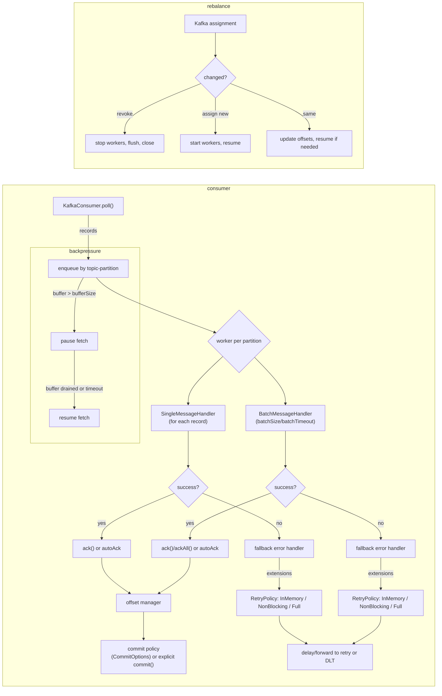

## How messages are processed with Quafka

1. The consumer’s poll loop fetches records and enqueues them to the corresponding topic-partition worker.
2. Each partition worker applies the configured message handling strategy:
   - Single message strategy invokes your `SingleMessageHandler` for each record.
   - Batch strategy groups records up to `batchSize` or `batchTimeout` and invokes `BatchMessageHandler`.
3. If `autoAckAfterProcess(true)` is enabled, records are acknowledged after successful handler execution. Otherwise call `incomingMessage.ack()` explicitly.
4. Commits are performed according to `CommitOptions` and/or via explicit `incomingMessage.commit()`/`commitAll()` calls.
5. Backpressure activates when the buffered, unacknowledged offsets exceed `backpressureBufferSize`. Polling pauses until the buffer drains or `backpressureReleaseTimeout` elapses.
6. Errors are passed to the strategy’s fallback error handler. With extensions, retries/delays/dead-letter routing can be applied.

### Flow diagram

Note: Animation is supported by some Mermaid renderers (e.g., transitions of edges), but if your doc viewer doesn’t animate, the static diagram still reflects the correct flow.

### Rebalancing details
- Quafka compares Kafka’s current assignment with its internal state on each rebalance tick.
- For revoked partitions, it stops workers, flushes offsets synchronously, and closes them.
- For new partitions, it creates workers at the assigned offset and resumes consumption immediately (unless paused by backpressure).
- For unchanged partitions, it updates the assigned offset and resumes if needed.

### Backpressure details
- Backpressure is evaluated per assigned topic-partition.
- When the buffered unacknowledged offsets for a partition exceed the configured threshold, that partition’s fetching is paused.
- Once the buffer drains (acks/commits) or the release timeout elapses, the partition resumes fetching.
